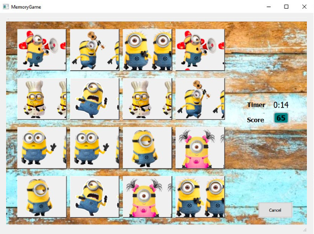
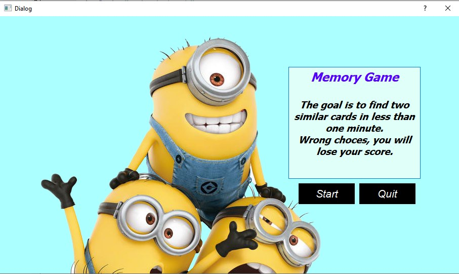
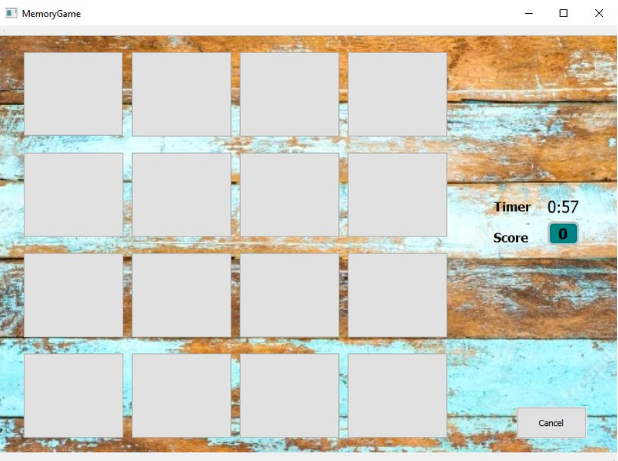
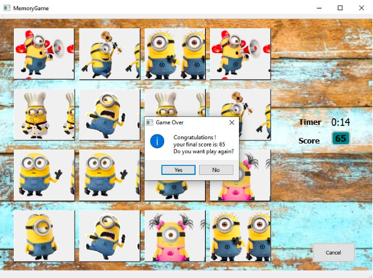
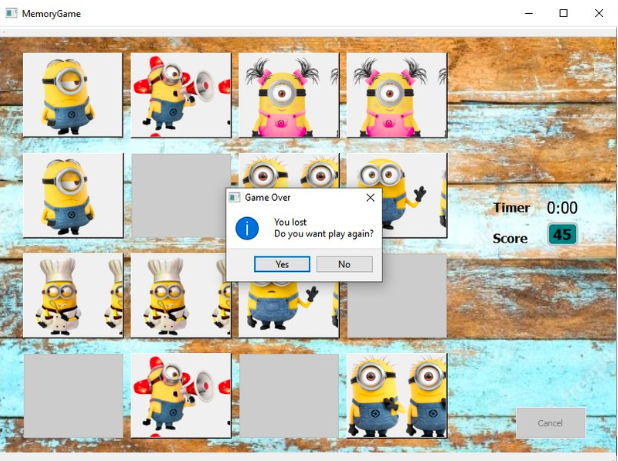

# Memory Game 
<br>

<p align="center">
  
</p>

---


**<span style="color:turquoise">The memory game  </span>**
 is a common children's game played with a set of cards.


 The cards have a pictures on one side and each picture appears on two  cards. The game starts with all the cards face down and players take turns to turn over two cards. If the two cards have the same picture, then they keep the cards, otherwise they turn the cards face down again. The winner is the person with the most cards when all the cards have been taken.


---

**Our goal today is to make this game in QT in c++ language. So let's enjoy it !**

<br>


> ## Game Description

<br>


* The deck consists of 8 different cards.
* Each turn, you flip over two cards (one at a time, so you can see the first one before picking the second)
If the two cards match, then they are removed from the game, otherwise they are returned.
* The game ends when all the cards are removed.
* When two similar cards are choosed you will have plus in your score.
* If your choice is failled so in this time you lose from your score.

**I think that the game is clear, So let's start!**

---
<br>

First view of the application is a window that describe the game for the player visiter ,Then the player must either choose play or exit if the game don't interest him.
<p align="center">
  
</p>

To build this form ,we use the Qt Designer ,Then to give sence to the buttons we create a class that we call it "**Intro**" and here is it's main implementation.

In the header file we declare the two main slots of the class

>The Header File (Intro.h)
```java script
namespace Ui {
class Intro;
}
class Intro : public QDialog
{
    Q_OBJECT
public:
    explicit Intro(QWidget *parent = nullptr);
    ~Intro();
//slots
private slots:
    //exit button 
    void on_pushButton_2_clicked();
    //start button
    void on_pushButton_clicked();
private:
    Ui::Intro *ui;
};


```
Now let's implement this two slots in Intro.cpp

>The Implementation File (Intro.cpp)

```java script
// To cancel the game 
Intro::on_pushButton_2_clicked(){
QCoreApplication->quit();
}

//To move to the game window and start playing
Intro::on_pushButton_clicked(){
    
    MainWindow w;
    w->show();
```


In the main class of the project we include **<span style="color:green">"intro.h" </span>** , Then we call it in order to dispaly it.

```java script
int main(int argc, char *argv[])
{
    QApplication a(argc, argv);

 Intro D;
 D.show();

    return a.exec();
}
```

<br>

The **<span style="color:turquoise">Start button  </span>** is clicked, that's take us to another class which is the game ,I mean it's implementation, it's traduction in c++.

<p align="center">
  
</p>


"**MemoryGame**" Class is the core of our game.

In it's header file we will declare all methods and functions of the game ;the traduction of the rules of this game in c++ language.

>The header File (MemoryGame.h)
```java script
namespace Ui { class MemoryGame; }


class MemoryGame : public QMainWindow
{
    Q_OBJECT

public:
    MemoryGame(QWidget *parent = nullptr);
    ~MemoryGame();
    //to get time
    QTimer *timer=new QTimer();
    QTime time;
    //a vector when wi will stock the cards
    QVector<QString> pictures{"fig01", "fig02", "fig03", "fig04",
                              "fig05", "fig06", "fig07", "fig08",
                              "fig09", "fig10", "fig11", "fig12",
                              "fig13","fig14","fig15","fig16"};
    //the repartition of the cards
    QHash<QString, QString> repartition;
    //initialize the score in 0
    int score=0;
    bool Start;
    //to get the previous card clicked
    QPushButton* previous;
    //to know the actual card clicked
    QPushButton* current;
    //to know the ramaining cards
    int PicRemaining;
    QMessageBox MessageBox;
private slots:
//to update the time
    void UpdateTime();
//get the cards already discovered
    void discoveredFig();
    //to give cards randomly
    void giveFig(QVector<QString> &pictures);
    //repartition of cards
    void repart(QVector<QString> &pictures, QHash<QString, QString> &repartition);
//to keep result of matching cards
    void defineResult();
    //reinitalize the game
    void reinitialize();
    //to show cards
    void Show();
    //to informate the player about it's status
    void finalResult();
    //to handle the timer
    void Status();
    //To start the game
    void StartGame();
private:
    Ui::MemoryGame *ui;
};
```
Now in the implemetation file let's go one by one slot

> The Implementation File (MemoryGame.cpp)

* First think, we will make connections possibles beteween slots and buttons.
```java script
{
    ui->setupUi(this);

    //Connect timer to the Status slot 
    connect(timer, SIGNAL(timeout()), this, SLOT(Status()));
    //Connect each button to the same slot, which will figure out which button was pressed and show its associated image file accordingly
    connect(ui->fig01, SIGNAL(clicked()), this, SLOT(discoveredFig()));
    connect(ui->fig02, SIGNAL(clicked()), this, SLOT(discoveredFig()));
    connect(ui->fig03, SIGNAL(clicked()), this, SLOT(discoveredFig()));
    connect(ui->fig04, SIGNAL(clicked()), this, SLOT(discoveredFig()));
    connect(ui->fig05, SIGNAL(clicked()), this, SLOT(discoveredFig()));
    connect(ui->fig06, SIGNAL(clicked()), this, SLOT(discoveredFig()));
    connect(ui->fig07, SIGNAL(clicked()), this, SLOT(discoveredFig()));
    connect(ui->fig08, SIGNAL(clicked()), this, SLOT(discoveredFig()));
    connect(ui->fig09, SIGNAL(clicked()), this, SLOT(discoveredFig()));
    connect(ui->fig10, SIGNAL(clicked()), this, SLOT(discoveredFig()));
    connect(ui->fig11, SIGNAL(clicked()), this, SLOT(discoveredFig()));
    connect(ui->fig12, SIGNAL(clicked()), this, SLOT(discoveredFig()));
    connect(ui->fig13, SIGNAL(clicked()), this, SLOT(discoveredFig()));
    connect(ui->fig14, SIGNAL(clicked()), this, SLOT(discoveredFig()));
    connect(ui->fig15, SIGNAL(clicked()), this, SLOT(discoveredFig()));
    connect(ui->fig16, SIGNAL(clicked()), this, SLOT(discoveredFig()));
    StartGame();
}
```

```java script
// "givFig" is a slot that will give us the cards randomly

void MemoryGame::giveFig(QVector<QString> &pictures){
    unsigned seed = std::chrono::system_clock::now().time_since_epoch().count();
    shuffle (pictures.begin(), pictures.end(), std::default_random_engine(seed));
}
```
```java script
// "UpdateTime" is a slot that will update the time by minus one second in each second passt 

void MemoryGame::UpdateTime(){
    time=time.addSecs(-1);
    ui->Chrono->setText(time.toString("m:ss"));
}
```

```java script
// "repart" is a slot that will make the repartition of te cards 
void MemoryGame::repart(QVector<QString> &pictures, QHash<QString, QString> &repartition){
    auto c=pictures.begin();
    //loop for to visit all the cards
    for (int i=1; i<=8; i++){
        QString file_name="0"+QString::number(i)+".png";
        repartition[(*c)]=file_name;
        c++;
        repartition[(*c)]=file_name;
        c++;
    }
}
```
```java script
// "StartGame" is a slot that will run the game
void MemoryGame::StartGame(){
    //start turn
    Start=false;

    //Set score
    score=0;
    ui->scoreCount->setText(QString::number(score));;

    //Set matches counter
    PicRemaining=8;

    //Set clock for countdown
    time.setHMS(0,1,0);

    //Initialize countdown
    ui->Chrono->setText(time.toString("m:ss"));

    // Start timer with a value of 1000 milliseconds, indicating that it will time out every second.
    timer->start(1000);

    //Randomly sort tiles in container
    giveFig(pictures);

    //Grab pairs of tiles and bind the name of an image file to each pair
    repart(pictures, repartition);

    //enable tiles frame
    ui->frame->setEnabled(true);

    //enable every tile and reset its image
    QList<QPushButton *> buttons =  ui->centre->findChildren<QPushButton*>();
    foreach (QPushButton* b, buttons) {
        b->setEnabled(true);
        b->setStyleSheet("#" + b->objectName() + "{ }");
    }
}
```


```java script
// "defineResult" is a slot that  give result of matching cards

void MemoryGame::defineResult(){
    //check if there is a match (the current tile matches the previous tile in the turn)
    if (repartition[current->objectName()]==repartition[previous->objectName()]){
        score+=10;
        ui->scoreCount->setText(QString::number(score));
        PicRemaining--;

        //if there is a match, find out if all tiles have been matched.
        finalResult();
    }
    else{
        score-=2;
        ui->scoreCount->setText(QString::number(score));

        //disable the whole tile section so no tiles can be turned during the 1-second "memorizing period"
        ui->frame->setEnabled(false);

        //if there is no match, let user memorize tiles and after 1 second hide tiles from current turn so they can be used on another turn
        QTimer::singleShot(1000, this, SLOT(reinitialize()));
    }
}
```

```java script
// "finalResult" is a slot that  give us the results
void MemoryGame::finalResult(){
    MessageBox.setWindowTitle("Game Over");
    MessageBox.setIcon(QMessageBox::Information);
    MessageBox.setStandardButtons(QMessageBox::Yes);
    MessageBox.addButton(QMessageBox::No);
    MessageBox.setDefaultButton(QMessageBox::Yes);
    MessageBox.setEscapeButton(QMessageBox::No);

    if (PicRemaining==0){
        timer->stop();
        MessageBox.setText("Congratulations ! your final score is: " + QString::number(score) + "\nDo you want play again?");
        if (QMessageBox::Yes == MessageBox.exec()){
            StartGame();
        }
        else{
            QCoreApplication::quit();
        }
    }
    else{
        if (time.toString()=="00:00:00"){
            timer->stop();
            ui->frame->setEnabled(false);
            MessageBox.setText("you lost ;( \nDo you want play again?");
            if (QMessageBox::Yes == MessageBox.exec()){
                StartGame();
            }
            else{
                QCoreApplication::quit();
            }
        }
    }
}
```
 This slot show us that there is two case:
 * whene the player find all the similar pictures and the time is not over, a message box will display informing the player that he won and how much his score is.

 <p align="center">
  
</p>

* the other case in when the time is over and the player do not find all cards.

 <p align="center">
  
</p>

 NB: Always a restart game is offered.

 ```java script
 //"discoveredFig" is a slot that give the cards already discovered
 void MemoryGame::discoveredFig(){
    //get the tile that was pressed
    current=qobject_cast<QPushButton*>(sender());

    //get the image linked to that tile in the map and set tile background to it
    Show();

    //disable current tile so it can't be clicked again (unless there is no match, in which case it will be re-enabled)
    current->setEnabled(false);

    //do something depending on whether the revealed tile is the first or the second tile in the turn
    if (!Start){
        previous=current;
        Start=true;
    }
    else{
        //change score and display it
        defineResult();

        //reset turn
        Start=false;
    }
}
```

```java script
 //"status" is a slot to update time
 void MemoryGame::Status(){
    UpdateTime();
    //call of the finalResult slot
      finalResult();
}
```

```java script
//
void MemoryGame::Show(){
    QString nbrFig=current->objectName();
    QString img=repartition[nbrFig];
    current->setStyleSheet("#" + nbrFig + "{ background-image: url(://" + img + ") }");
}
```

```java script
//"reinitialize" is a slot reinitialize the game
void MemoryGame::reinitialize(){
    //return tiles from current turn to the default state (remove backgrounds)
    previous->setStyleSheet("#" + previous->objectName() + "{ }");
    current->setStyleSheet("#" + current->objectName() + "{ }");

    //re-enable both tiles so they can be used on another turn
    current->setEnabled(true);
    previous->setEnabled(true);

    //re-enable the whole tile section
    ui->frame->setEnabled(true);
}
```


<br>

---

<br>

**Memory Game** has long been a favorite game for all generations. It is easy to play, in fact it is so simple that really young children can play with ease.

It requires observation, concentration and a good memory to win.

Also he was a tool to enrich and practice our knowledge in c++ and qt programming.

In this case ,We express our sincere regards to our professor **Dr.Belcaid Anass** who has
contributed to the success of this module during these years.

<br>

<br>

<br>


 <h1 align="center">Thank You ! </h1>


